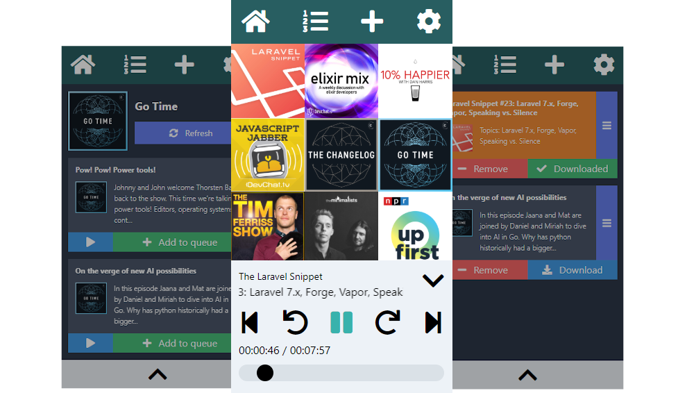

# Podrain



Podrain is a web-based podcast app with offline capabilities. It was built to scratch my own itch, and there are a *lot* of rough edges (I would define it's current state as "usable alpha"), but I'm using the app for all of my podcast-listening needs now. Some features include:

- Pure focus on podcasts (no radio, news, video podcasts, music, etc.)
- Mobile-first design
- Customizable episode queue
- All podcast data is stored in your browser, no need to sign up for a service
- Respects privacy, doesn't track your listening habits
- Optionally store audio files offline for an uninterrupted listening experience
- Easily back up all your podcast data to a file

## Requirements
Two things are needed to use Podrain, which are:

### A browser
- Chrome (Android, desktop)
- Chromium-based browsers (Brave, Edge, etc.)
- Firefox (desktop)
- ... and probably others, but the above have been confirmed to work throughout the development process.

### Note about iOS
At this time, Podrain is not fully functional on iOS on any browser, Safari or otherwise. iOS doesn't have enough storage for for downloading the audio files for offline listening. Other functionality should work fine, however.

## Setup
Installing Podrain is very easy. It's a single-page web application, so all you have to do load the app is visit the page!

https://podrain.gitlab.io/podrain/#!/podcasts

## Running the app locally (for testing and development)

### Requirements
- [Node](https://nodejs.org/en/)
- [Yarn](https://yarnpkg.com/)

```bash
git clone https://github.com/podrain/podrain
cd podrain
yarn install
npx parcel src/index.html
```

Then, just visit http://localhost:1234 in your browser to see the app running. It's a HMR server so you should see changes to the code without having to refresh your browser.

## Roadmap
- Progressive web app functionality (service workers, web app manifest file) which will allow for true offline-first capability
- Better interface for tablet/desktop screen sizes